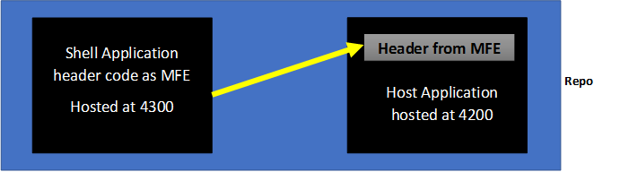
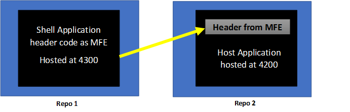

# Micro-frontend with Module Federation and Angular

We will implement the micro frontend using module federation which is a few feature introduced in webpack5 and the framework we will use throughout the series is Angular.

Two types of micro frontends
1.	Mono repo
2.	Multi repo

## Mono Repo

It means we will have a single repository inside which we will have a multiple projects / applications. In our case say we are having one application called shell application inside which we are having a header code which we made as MFE (micro front end). This code of the application is hosted at server with port number 4300. Now this shell application should expose this code this header code so that other application which will be known as host application can consume the header code. 
So we will have another application inside the same repository called host application and it is hosted at 4200 port. Now this host application will consume the code basically the front-end code that is getting exposed from the shell application and that code is nothing but header code. So host application is displaying header which is coming from MFE that is micro frontend and that is hosted on different server. So we are sharing front-end code from one server to another server and this is what is called micro front end. But since we have both application inside the same repo it is known as mono repo.
In some scenario we will not have both the application that is the shell application and the host application inside the same repo. That’s why we have another concept called Multi repo.

## Multi Repo

In multi repo we will have another two different repos or we will have more than two repos, depend on the structure or number of shell applications and host application. 
In our case to make it simple we are having two repos one is called repo one and one is called repo two. In repos one we will have own shell application and it is hosted on the same server with the same port 300 side which we are having the same header code which will be our MFE and this header code will be exposed from the shell application. Now this shell application will be used in the host application so we are having another repository called repo2 and inside this we are having our host application which is hosted at port number 4200. Now this host application will consume this shell application that is this header code. So this header in the host application is coming from MFE that is micro front end which is hosted at 4300 port. So if we compare both the repo structure we will find that the behavior is not different it’s the same.
One application which is called Shell application hosted on one server and there is a host application hosted on another and host application is consuming the shell application code. The condition is only one that is shell application should expose their code so that host application can consume them. 
But the only difference between mono and multi repo MFE is the number of repos. In mono repo case, we are having one repository and multi repo case, we are having multiple repositories. 
