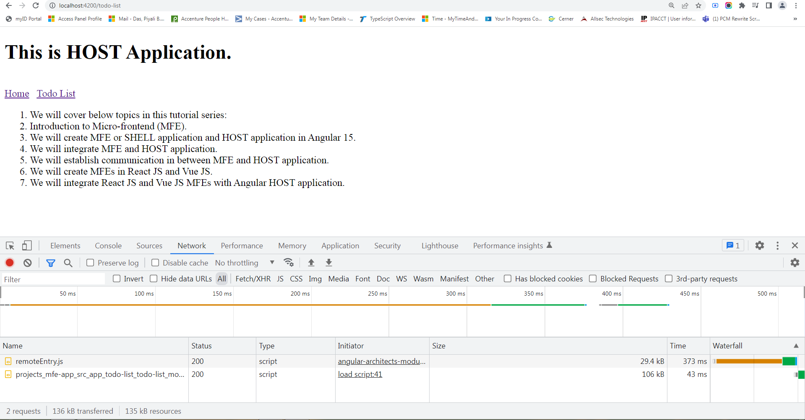

# Micro-frontend with Module Federation and Angular in Mono Repo/Workspace



### Tutorial
https://www.youtube.com/watch?v=1FWAGSVsmrI&list=PL1UWPWOy5UlfLWfSstHBW-iVu6RWJtrG-
https://www.youtube.com/watch?v=wVKR-UEEew8&list=PL1UWPWOy5UlfLWfSstHBW-iVu6RWJtrG-&index=9

### Run application
```
cd mono-workspace
ng serve host-app --port=4200
ng serve mfe-app --port=4300
ng serve mfe-quiz-app --port=4400
```

### create micro-front end application
don't want to create any project inside Workspace at time workspace creation


```
npx @angular/cli@12 new mono-workspace --createApplication=false
cd mono-workspace
ng g application host-app --routing --style=scss
ng g application mfe-app --routing --style=scss
ng g application mfe-quiz-app --routing --style=scss
npm i webpack webpack-cli --save-dev
ng add @angular-architects/module-federation@12 --project host-app --port 4200
ng add @angular-architects/module-federation@12 --project mfe-app --port 4300
ng add @angular-architects/module-federation@12 --project mfe-quiz-app --port 4400
```

these both projects share same node_modules of mono-workspace
need to install module-federation version which is matching with angular cli

if not proprly installed
```
npm i @angular-architects/module-federation@12 --force
```

3. create component inside host-app
```
ng g c home --project=host-app
```

4. create component inside mfe-app
```
ng g module todo-list --project=mfe-app
ng g c todo-list --project=mfe-app
```

5. made changes in webpack.config.js of mfe-app
stop already running mfe-app and start again
todo-list.module has been exposed with the name of TodoModule
todo-list.module has been exposed in a file remoteEntry.js. it means whatever is inside todo-list module it will be available in a file called remoteEntry.js
now check in browser http://localhost:4300/remoteEntry.js is opening or not
now find this word (TodoModule) in http://localhost:4300/remoteEntry.js of browser

```
 name: "mfeApp",
        filename: "remoteEntry.js",
        exposes: {
           // './Component': './projects/mfe-app/src/app/app.component.ts',
           './TodoListModule': './projects/mfe-app/src/app/todo-list/todo-list.module.ts',
        },      
```        

remotes property of mfe-app will be used when we consume MFE from another server
```
    remotes: {
         "hostApp": "hostApp@http://localhost:4200/remoteEntry.js",

    },
```

shared property of mfe-app shares common libraries. common libraries means in between host-app & mfe-app in both our case since both are in angular, so both have angular core, common, common/http & router libraries. So when we load mfe-app in the host-app, then we don't want to load the same libraries twice. This shared object creates a single instance of each library that has been mentioned inside shaed object so so if there are common libraries in between mfe & host you can mention them in this shared object to create a single nstance of these libraries.

6. 
add scriptType: "text/javascript" in output of module.exports of wepack.config.js of mfe-app to remove console error
remove library: { type: "module" } from plugins of module.exports of wepack.config.js of mfe-app & host-app as it is not required

7. un-comments this remotes object of wepack.config.js of host-app
```
// remotes: {
        //     "mfeApp": "mfeApp@http://localhost:4300/remoteEntry.js",

        // },
```
in this remote object we need to define the URL of the Server from where we need to fetch the MFE. We will also un-comment the name key of ModuleFederationPlugin to identify this webpack.config file uniquely. 

8. now go app-routing.module.ts of host-app because here only we need to load MFE app when we route to todo-list. remove TodoComponent from everywhere of app-routing.module.ts of host-app..add loadChildren with anynomous function which will return function result and that function belong to the module federation package. that function is known as loadRemoteModule. this function expects an object of few parameters like
remoteEntry ( we have defined the URL from where the MFE will be fetched. so we can put the MFE remoteEntry.js file link)
remoteName ( unique name of MFE if i got to the webpack.config.js of mfe-app, unique name is given as mfeApp)
exposedModule ( the module we have exposed from the MFE app so go to the webpack.config.js of mfe-app and the module which we exposed TodoModule)
```
{
    path: 'todo-list',
    loadChildren: () => {
      return loadRemoteModule({
        remoteEntry: MFE_APP_URL,
        remoteName: "mfeApp",
        exposedModule: "./TodoListModule"
      }).then(m => m.TodoListModule).catch(err => console.log(err));
    }
  }
```  
9. go to the todo-list.module.ts of mfe-app because we have exposed todo-list.module from mfe-app
leftside moule will be the same module name of rightside module.ts file
```
exposes: {
           // './Component': './projects/mfe-app/src/app/app.component.ts',
           './TodoListModule': './projects/mfe-app/src/app/todo-list/todo-list.module.ts',
        }, 
```

make the changes todo-list.module.ts of mfe-app
```
@NgModule({
  declarations: [
    TodoListComponent
  ],
  imports: [
    CommonModule,
    BrowserModule,
    RouterModule.forChild([
      {
        path: '',
        component: TodoListComponent
      }
    ])
  ]
})
```

9. Open http://localhost:4200/home link in browser and see the network tab, there is no such remoteEntry file has been loaded. MFE app will be loaded on demand, whenever the user requests then only be loaded. 
now click on Todo List tab and see the Network tab, you will see remoteEntry.js file and todo-list content of mfe-app will be visible
